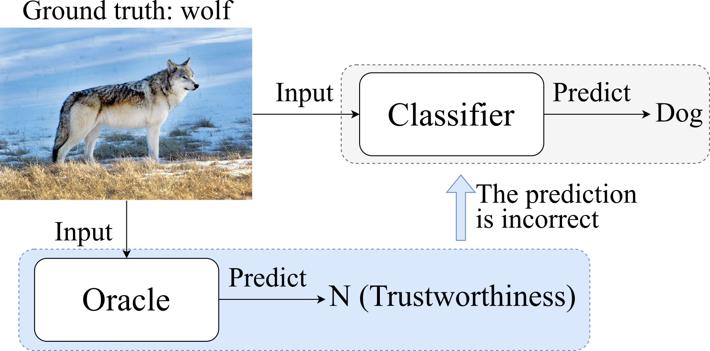

[//]: # (Referenced repo: https://github.com/arthurdouillard/CVPR2021_PLOP/blob/main/README.md)
# Learning to Predict Trustworthiness with Steep Slope Loss

[](https://arxiv.org/abs/2110.00054)



## Abstract

Understanding the trustworthiness of a prediction yielded by a classifier is critical for the safe and effective use of AI models. Prior efforts have been proven to be reliable on small-scale datasets. In this work, we study the problem of predicting trustworthiness on real-world large-scale datasets, where the task is more challenging due to high-dimensional features, diverse visual concepts, and large-scale samples. In such a setting, we observe that the trustworthiness predictors trained with prior-art loss functions, i.e., the cross entropy loss, focal loss, and true class probability confidence loss, are prone to view both correct predictions and incorrect predictions to be trustworthy. The reasons are two-fold. Firstly, correct predictions are generally dominant over incorrect predictions. Secondly, due to the data complexity, it is challenging to differentiate the incorrect predictions from the correct ones on real-world large-scale datasets. To improve the generalizability of trustworthiness predictors, we propose a novel steep slope loss to separate the features w.r.t. correct predictions from the ones w.r.t. incorrect predictions by two slide-like curves that oppose each other. The proposed loss is evaluated with two representative deep learning models, i.e., Vision Transformer and ResNet, as trustworthiness predictors.


More details can be found in our paper ([arXiv](https://arxiv.org/abs/2110.00054)). This project is based on [ASYML ViT](https://github.com/asyml/vision-transformer-pytorch). The code is tested with Python 3.8.5 and PyTorch 1.7.1 under Ubuntu 1804 equipped with four Nvidia GTX 1080 ti graphics cards.


## Citation
If you use this code for your research, please consider citing:
```
@inproceedings{Luo_NeurIPS_2021,
  title={Learning to Predict Trustworthiness with Steep Slope Loss},
  author={Luo, Yan and Wong, Yongkang and Kankanhalli, Mohan and Zhao, Qi},
  booktitle={Advances in Neural Information Processing Systems},
  year={2021}
}
```

# Installation

Create environment with requirements (please refer to [ASYML ViT](https://github.com/asyml/vision-transformer-pytorch) for more details):
```
conda create --name steep --file requirements.txt
conda activate steep
```

# Pre-trained ViT for Initializing Oracles

Download imagenet21k+imagenet2012_ViT-B_16.pth from [ASYML ViT](https://github.com/asyml/vision-transformer-pytorch) and put the pre-trained model under 'pretrained/'.


# ImageNet

Download the [ImageNet](https://image-net.org/download.php) dataset and organize it as follows.
```
./data/
└── ImageNet
    ├── ILSVRC2012_devkit_t12.tar.gz
    ├── train
    │   │── n02087394
    │   ...
    └── val
        │── n02087394
        ...
```


# Oracle Training

Edit [scripts/train_oracle.sh](scripts/train_oracle.sh) to make sure variable DATA point to the organized folder mentioned above. Then, run the script by
```
./scripts/train_oracle.sh
```
Please see more details in script file train_oracle.sh.

For each experiment, the program will create an experiment folder under experiments/save/. The folder name is something like oracle_ovit_cvit_ce_ImageNet_bs40_lr1e-05_wd0.0_210604_001349. The trained oracle will be saved to oracle_ovit_cvit_ce_ImageNet_bs40_lr1e-05_wd0.0_210604_001349/checkpoints/ and the corresponding trustworthiness predictions will be saved to oracle_ovit_cvit_ce_ImageNet_bs40_lr1e-05_wd0.0_210604_001349/results/.

# Evaluation with Pre-trained Oracle

The training process will include the validation. For convenience, we also provide the evaluation script in case that we'd like to use the pre-trained oracle to evaluate on any datasets.

Basically, the hyperparameters are the similar to the training ones, but there is an additional hyperparameter, i.e., oracle-pretrained, which indicates the path to the pre-trained oracle.

Script [scripts/eval_oracle.sh](scripts/eval_oracle.sh) give an example with the cross entropy loss. To evaluate the oracle pre-trained with the cross entropy loss, run
```
./scripts/eval_oracle.sh
```

# Evaluation with Predictions

We save the trustworthiness predictions yielded by the pre-trained oracle. So we are able to easy to check out the performane by two steps.

First, edit [src/eval_predictions.py](src/eval_predictions.py)
```
tn_th = 0.5 # if evaluating TCP's predictions, tn_th = 1.0/1000, otherwise 0.5
input_npz = '/path-to-the-experiment-folder/results/val_ep01_oracle_pred.npz'
```
Second, run the script
```
python src/eval_predictions.py
```


# Evaluation with Pre-trained Oracle on Stylized ImageNet and Corrupted ImageNet

To this end, you would need to refer to [Stylized-ImageNet](https://github.com/rgeirhos/Stylized-ImageNet) or [ImageNet-C](https://github.com/hendrycks/robustness) to generate the stylized validation set or download the corrupted ImageNet validation set.

Then, you can replace all the regular validation images with all the stylized/corrupted validation images. But we suggest that you can create a new folder like sty_data/ImageNet (or crp_data/ImageNet), then use 'ln -s' to create a soft copy of data/ImageNet/ILSVRC2012_devkit_t12.tar.gz and folder data/ImageNet/train in sty_data/ImageNet/ (or crp_data/ImageNet/).

# Evaluation with Pre-trained Oracle on Adversarial ImageNet

Please refer to [ReColorAdv](https://github.com/cassidylaidlaw/ReColorAdv) to download and set up the project.

Edit [src/eval_oracle_adversarial.py](src/eval_oracle_adversarial.py)
```
import sys
sys.path.insert(1, '/path-to-ReColorAdv')
```

Also, edit [scripts/eval_oracle_adv.sh](scripts/eval_oracle_adv.sh)
```
--oracle-pretrained '/path-to-the-experiment-folder/checkpoints/ep_01.pth'
```

Then, we can run 
```
./scripts/eval_oracle_adv.sh
```

# Pre-trained Oracles and Corresponding Predictions

We provide both the pre-trained oracles and the corresponding predictions in npz files. They can be downloaded via this [link](https://drive.google.com/drive/folders/1F9MfxLLKtibgTVVIPgq_D6D9Jma4vxmi?usp=sharing).


# License
[MIT License](./LICENSE)
